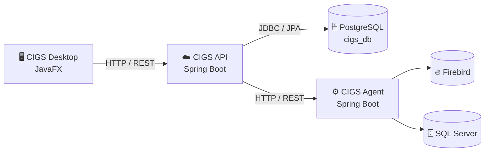

# 🎯 CIGS — Central de Comandos Integrados


> **Migração completa** do CIGS original, desenvolvido em Python/Flask/Tkinter, para uma arquitetura moderna baseada em **Java 21 + Spring Boot 3.3.5 + JavaFX**.

O **CIGS — Central de Comandos Integrados** é uma plataforma de gerenciamento e automação de infraestrutura de servidores.

A solução permite:

* 🖥️ Cadastro e gerenciamento de servidores
* 📡 Monitoramento de infraestrutura em tempo real
* ❤️ Heartbeat e auto-registro de agentes
* 🚀 Disparo de atualizações e missões em massa
* 📅 Agendamento de tarefas
* 🗄️ Verificação de integridade de bancos Firebird e MSSQL
* 📦 Download e instalação de pacotes de atualização
* 🧹 Limpeza e manutenção de arquivos e logs
* 📊 Dashboard com indicadores e KPIs
* 🔌 Comunicação entre Central, Agentes e servidores monitorados

A plataforma é composta por uma **API REST central**, um **agente instalado nos servidores monitorados** e uma **aplicação desktop JavaFX** para operação.

---

## 📑 Índice

* [Arquitetura](#-arquitetura)
* [Módulos](#-módulos)
* [Tecnologias](#️-tecnologias)
* [Pré-requisitos](#-pré-requisitos)
* [Configuração](#️-configuração)
* [Executando](#-executando)
* [Estrutura do projeto](#-estrutura-do-projeto)
* [API REST](#-api-rest)
* [Testando](#-testando)
* [Roadmap](#️-roadmap)
* [Contribuindo](#-contribuindo)
* [Autor](#-autor)
* [Licença](#-licença)

---

# 🏗️ Arquitetura

O projeto utiliza uma arquitetura **multi-módulo Maven**, separando as responsabilidades entre API, agente e aplicação desktop.

```text
cigs-workspace/
│
├── cigs-api
│   └── API REST central
│
├── cigs-agent
│   └── Agente instalado nos servidores
│
└── cigs-desktop-javafx
    └── Aplicação desktop JavaFX
```

### Visão geral



### Fluxo de comunicação

#### Desktop → API

A aplicação desktop realiza requisições HTTP/REST para a API central.

```text
┌─────────────────────────┐
│   CIGS Desktop JavaFX   │
│                         │
│ Interface / Dashboard   │
└────────────┬────────────┘
             │
             │ HTTP / REST
             ▼
┌─────────────────────────┐
│       CIGS API          │
│     Spring Boot         │
└────────────┬────────────┘
             │
             │ JDBC / JPA
             ▼
┌─────────────────────────┐
│       PostgreSQL        │
│         cigs_db         │
└─────────────────────────┘
```

#### API → Agentes

A API central também se comunica com os agentes instalados nos servidores dos clientes.

```text
┌─────────────────────────┐
│       CIGS API          │
│     Spring Boot         │
└────────────┬────────────┘
             │
             │ HTTP / REST
             ▼
┌─────────────────────────┐
│      CIGS Agent         │
│     Spring Boot         │
└────────────┬────────────┘
             │
             ├──────────► Firebird
             │
             └──────────► SQL Server
```

---

# 📦 Módulos

## 🔹 `cigs-api`

### API REST Central

Serviço responsável por centralizar as regras de negócio, persistência e comunicação com os demais componentes do CIGS.

### Responsabilidades

* CRUD de servidores
* Cadastro e gerenciamento de infraestrutura
* Persistência no PostgreSQL
* Validação de dados
* Exposição da API REST
* Comunicação com os agentes
* Controle centralizado das operações

### Stack

* Spring Boot 3.3.5
* Spring Web
* Spring Data JPA
* Hibernate
* PostgreSQL
* Jakarta Validation

---

## 🔹 `cigs-agent`

### Agente de Servidor

Aplicação Spring Boot instalada nos servidores monitorados.

O agente recebe comandos da Central e executa operações diretamente no ambiente do cliente.

### Responsabilidades

* Expor status do servidor
* Informar versão e hash do agente
* Monitorar clientes ativos
* Informar uso de disco e memória RAM
* Agendar tarefas no Windows Task Scheduler
* Baixar pacotes de atualização
* Extrair arquivos `.rar`
* Verificar integridade de bancos Firebird
* Verificar integridade de bancos MSSQL
* Sanitizar arquivos extraídos
* Limpar logs antigos do CloudUp
* Executar tarefas de manutenção
* Enviar heartbeat para a Central
* Realizar auto-registro na API

### Stack

* Spring Boot 3.3.5
* Spring Web
* Spring Boot Actuator
* Jaybird
* Microsoft SQL Server JDBC Driver

---

## 🔹 `cigs-desktop-javafx`

### Aplicação Desktop

Aplicação gráfica utilizada pela equipe de infraestrutura para operação e gerenciamento do ambiente.

### Responsabilidades

* Login com senha mestra
* Visualização de servidores
* Cadastro e gerenciamento de infraestrutura
* Scan de infraestrutura
* Monitoramento em tempo real
* Disparo de missões em massa
* Deploy e atualização
* Manutenção de servidores
* Dashboard operacional
* Visualização de gráficos e KPIs

### Stack

* JavaFX 21
* Spring Boot
* Spring Data JPA
* BCrypt
* OpenCSV

---

# 🛠️ Tecnologias

| Camada              | Tecnologia                      |
| ------------------- | ------------------------------- |
| Linguagem           | Java 21 LTS                     |
| Build               | Maven 3.9+                      |
| Framework           | Spring Boot 3.3.5               |
| GUI                 | JavaFX 21                       |
| Persistência        | Spring Data JPA / Hibernate     |
| Banco central       | PostgreSQL 14+                  |
| Bancos dos clientes | Firebird / SQL Server           |
| Segurança           | Spring Security Crypto / BCrypt |
| Serialização        | Jackson                         |
| Logs                | Logback / SLF4J                 |
| Testes              | JUnit 5 / Mockito / TestFX      |

---

# ✅ Pré-requisitos

Antes de executar o projeto, certifique-se de possuir:

* **JDK 21 LTS**
* **Maven 3.9+**
* **PostgreSQL 14+**
* IDE compatível com Maven

### JDK

Recomendado:

* [Eclipse Temurin / Adoptium](https://adoptium.net/)

### Maven

* [Apache Maven](https://maven.apache.org/download.cgi)

### IDE

Compatível com:

* IntelliJ IDEA
* Eclipse
* Spring Tool Suite (STS)

---

# ⚙️ Configuração

## 1. Clone o repositório

```bash
git clone https://github.com/Biellima2811/CIGS-WorkSpace-JAVA.git

cd CIGS-WorkSpace-JAVA
```

---

## 2. Configure o PostgreSQL

Crie o banco:

```sql
CREATE DATABASE cigs_db;
```

Caso a tabela `servidores` ainda não exista:

```sql
CREATE TABLE servidores (
    id                  SERIAL PRIMARY KEY,
    ip                  VARCHAR(45) UNIQUE NOT NULL,
    hostname            VARCHAR(255),
    ip_publico          VARCHAR(45),
    funcao              VARCHAR(50),
    cliente             VARCHAR(255),
    usuario_especifico  VARCHAR(255),
    senha_especifica    VARCHAR(255),
    criado_em           TIMESTAMP DEFAULT NOW()
);
```

---

## 3. Configure a conexão com o banco

Edite:

```text
cigs-api/src/main/resources/application.yml
```

Exemplo:

```yaml
spring:
  datasource:
    url: jdbc:postgresql://localhost:5432/cigs_db
    username: postgres
    password: SUA_SENHA_AQUI
```

> ⚠️ **Importante:** nunca versione senhas reais, tokens ou credenciais no Git.
>
> Em ambientes de produção, utilize variáveis de ambiente ou um mecanismo seguro de gerenciamento de secrets.

---

# 🚀 Executando

## Build completo

Na raiz do projeto:

```bash
mvn clean install -DskipTests
```

---

## ▶️ Executar a API

```bash
cd cigs-api

mvn spring-boot:run
```

Por padrão:

```text
http://localhost:8080
```

---

## 🖥️ Executar o Desktop

Em outro terminal:

```bash
cd cigs-desktop-javafx

mvn javafx:run
```

---

## ⚙️ Executar o Agente

```bash
cd cigs-agent

mvn spring-boot:run
```

---

# 📂 Estrutura do projeto

```text
cigs-workspace/
│
├── pom.xml
│   └── POM pai / agregador
│
├── cigs-api/
│   ├── pom.xml
│   │
│   └── src/main/
│       ├── java/br/com/fortes/cigs/api/
│       │
│       ├── CigsApiApplication.java
│       │
│       └── server/
│           ├── Servidor.java
│           │   └── Entidade JPA
│           │
│           ├── ServidorDTO.java
│           │   └── DTO de resposta
│           │
│           ├── ServidorFormDTO.java
│           │   └── DTO de entrada
│           │
│           ├── ServidorRepository.java
│           │   └── Repositório JPA
│           │
│           ├── ServidorService.java
│           │   └── Regras de negócio
│           │
│           └── ServidorController.java
│               └── Endpoints REST
│
│       └── resources/
│           └── application.yml
│
├── cigs-agent/
│   ├── pom.xml
│   │
│   └── src/main/java/br/com/fortes/cigs/agent/
│       │
│       ├── AgentApplication.java
│       │
│       ├── config/
│       │
│       ├── controller/
│       │
│       ├── service/
│       │
│       └── util/
│
└── cigs-desktop-javafx/
    ├── pom.xml
    │
    └── src/main/
        │
        ├── java/br/com/fortes/cigs/desktop/
        │   │
        │   ├── CentralApplication.java
        │   │
        │   ├── ui/
        │   │   ├── controller/
        │   │   └── dialog/
        │   │
        │   └── service/
        │
        └── resources/
            ├── fxml/
            ├── css/
            └── application.yml
```

---

# 🔌 API REST

## Servidores

Base URL:

```text
/api/v1/servers
```

| Método   | Endpoint               | Descrição                 | Sucesso | Erro        |
| -------- | ---------------------- | ------------------------- | ------- | ----------- |
| `GET`    | `/api/v1/servers`      | Lista todos os servidores | `200`   | —           |
| `GET`    | `/api/v1/servers/{ip}` | Busca servidor pelo IP    | `200`   | `404`       |
| `POST`   | `/api/v1/servers`      | Cadastra novo servidor    | `201`   | `400 / 409` |
| `PUT`    | `/api/v1/servers/{id}` | Atualiza servidor por ID  | `200`   | `400 / 404` |
| `DELETE` | `/api/v1/servers/{id}` | Remove servidor por ID    | `204`   | `404`       |

---

## Agente

Base URL:

```text
/cigs
```

| Método | Endpoint            | Descrição                           |
| ------ | ------------------- | ----------------------------------- |
| `GET`  | `/cigs/status`      | Retorna status do agente            |
| `POST` | `/cigs/executar`    | Agenda execução de script           |
| `POST` | `/cigs/check_db`    | Verifica integridade do banco       |
| `GET`  | `/cigs/relatorio`   | Retorna relatório de execuções      |
| `POST` | `/cigs/abortar`     | Cancela tarefas em execução         |
| `POST` | `/cigs/descomentar` | Descomenta clientes no `config.ini` |
| `POST` | `/cigs/limpar_logs` | Remove logs antigos do CloudUp      |
| `POST` | `/cigs/register`    | Realiza auto-registro do agente     |

---

# 🧪 Testando a API

Com o `cigs-api` em execução, os endpoints podem ser testados utilizando **cURL**, Postman ou diretamente pelo navegador para requisições `GET`.

## Listar servidores

```bash
curl http://localhost:8080/api/v1/servers
```

---

## Buscar servidor por IP

```bash
curl http://localhost:8080/api/v1/servers/10.100.104.19
```

---

## Cadastrar servidor

```bash
curl -X POST http://localhost:8080/api/v1/servers \
  -H "Content-Type: application/json" \
  -d '{
    "ip": "192.168.1.10",
    "hostname": "SRV-TESTE",
    "funcao": "App",
    "cliente": "Cliente Demo"
  }'
```

---

## Atualizar servidor

```bash
curl -X PUT http://localhost:8080/api/v1/servers/1 \
  -H "Content-Type: application/json" \
  -d '{
    "ip": "192.168.1.11",
    "hostname": "SRV-ATUALIZADO"
  }'
```

---

## Remover servidor

```bash
curl -X DELETE http://localhost:8080/api/v1/servers/1
```

---

### 🌐 Teste rápido pelo navegador

Com a API em execução:

```text
http://localhost:8080/api/v1/servers
```

O endpoint retornará a lista de servidores em formato JSON.

---

# 🗺️ Roadmap

| Fase | Descrição                                |      Status     |
| ---: | ---------------------------------------- | :-------------: |
|    1 | Fundação e setup multi-módulo Maven      |   ✅ Concluído   |
|    2 | Migração do agente para Spring Boot REST |   ✅ Concluído   |
|    3 | Central: banco, segurança e login        |   ✅ Concluído   |
|    4 | Central: infraestrutura + cliente HTTP   | 🚧 Em andamento |
|    5 | Renomear aba + novo Dashboard com KPIs   |    ⏳ Pendente   |
|    6 | Tela de configuração de banco + limpezas |    ⏳ Pendente   |
|    7 | Homologação e entrega                    |    ⏳ Pendente   |

---

# 🤝 Contribuindo

Contribuições devem seguir o fluxo padrão de desenvolvimento utilizando branches e Pull Requests.

### 1. Faça um fork do projeto

```bash
git fork
```

### 2. Crie uma branch

```bash
git checkout -b feature/nova-funcionalidade
```

### 3. Faça suas alterações

Após implementar e testar a funcionalidade:

```bash
git add .
```

### 4. Realize o commit

```bash
git commit -m "Adiciona nova funcionalidade"
```

### 5. Envie a branch

```bash
git push origin feature/nova-funcionalidade
```

### 6. Abra um Pull Request

Descreva:

* O que foi alterado
* Motivo da alteração
* Impacto no sistema
* Como testar
* Possíveis pontos de atenção

---

# 👤 Autor

**Gabriel Levi**

* GitHub: [@Biellima2811](https://github.com/Biellima2811)
* Empresa: **Fortes Tecnologia**

---

# 📄 Licença

Este projeto é de **uso interno e proprietário da Fortes Tecnologia**.

Todos os direitos reservados.

© 2026 Fortes Tecnologia.

---

<p align="center">
  <strong>CIGS — Central de Comandos Integrados</strong>
  <br>
  Versão 4.0 · Java Edition
  <br>
  © 2026 Fortes Tecnologia
</p>
